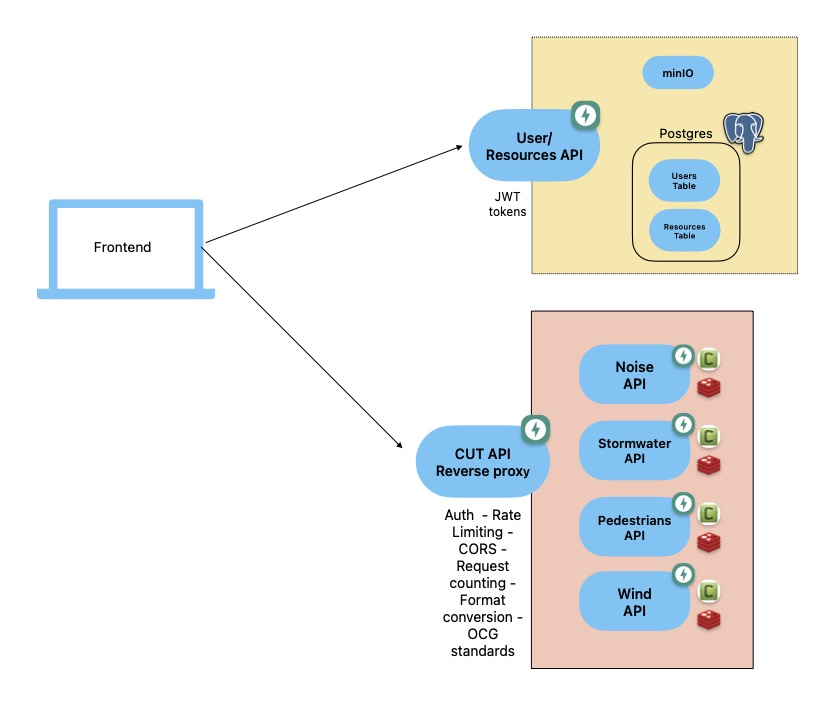

# CUT Prototype Public API



A FastAPI-based API that acts as a `reverse proxy`, forwarding requests to different target servers (noise, water, wind) based on the requested endpoint's path. It also centralises the following features:
1) rate limiting; 
2) authorization; 
3) request event metadata logging by user;
4) `CORS` support;
5) response format conversion (PNG, geojson).


### Linked Repositories

| Project                                     | GitHub Repository Link                                   | Description                                                |
|---------------------------------------------|----------------------------------------------------------|------------------------------------------------------------|
| CUT Prototype User Management               | [Link](https://github.com/digitalcityscience/CUT_Prototype_UserManagement) | Repository for the CUT Prototype User Management project.   |
| COUP Noise API v2                           | [Link](https://github.com/digitalcityscience/COUP-noise-api-v2) | Repository for COUP Noise API version 2.                    |
| COUP Stormwater API v2                      | [Link](https://github.com/digitalcityscience/COUP-stormwater-api-v2-) | Repository for COUP Stormwater API version 2.               |
| COUP Wind                                   | [Link](https://github.com/digitalcityscience/COUP-wind)    | Repository for the COUP Wind project.                       |


- **Noise, Water, and Wind APIs**: These services are accessible only within the internal network and are not exposed externally. To interact with these APIs, requests need to be sent to the public API, which acts as a forwarder.

For detailed documentation on the endpoints and processes available:

| Service          | Documentation Link                                   | Description                                           |
|------------------|------------------------------------------------------|-------------------------------------------------------|
| Noise API        | [Documentation](https://api.city-scope.hcu-hamburg.de/cut-public-api/noise/docs) | Detailed documentation for the Noise API.            |
| Noise API (ReDoc)| [ReDoc](https://api.city-scope.hcu-hamburg.de/cut-public-api/noise/redoc) | Interactive API documentation using ReDoc.          |
| Noise API (OpenAPI)| [OpenAPI JSON](https://api.city-scope.hcu-hamburg.de/cut-public-api/noise/openapi.json) | OpenAPI JSON specification for the Noise API.        |
| Stormwater API   | [Documentation](https://api.city-scope.hcu-hamburg.de/cut-public-api/stormwater/docs) | Detailed documentation for the Stormwater API.       |
| Stormwater API (ReDoc)| [ReDoc](https://api.city-scope.hcu-hamburg.de/cut-public-api/stormwater/redoc) | Interactive API documentation using ReDoc.          |
| Stormwater API (OpenAPI)| [OpenAPI JSON](https://api.city-scope.hcu-hamburg.de/cut-public-api/stormwater/openapi.json) | OpenAPI JSON specification for the Stormwater API.  |


### Important Note

- **Token Signing Key**: It is crucial to ensure that the token signing key remains consistent between the User Management API and the Public API for proper functionality.

- **Api-specific Swagger Documentation**: Detailed documentation for each of the calculating APIs (Noise, Water, Wind) is accessible through the following endpoints:
- Noise API: /noise/docs
- Water API: /water/docs
- Wind API: /wind/docs
Similarly, you can retrieve the OpenAPI specification and ReDoc documentation using the following endpoints:
- OpenAPI JSON: /<api_prefix>/openapi.json
- ReDoc: /<api_prefix>/redoc
This provides a clearer and more organized presentation of the information about the API-specific Swagger Documentation.


## Local Dev

### Initial Setup

The `CUT Prototype Public API` is run on `Docker`, however it is still necessary to create a `Python` virtual environment to run tests, run a script to create internal users and enable linting for pre-commit hooks. Run the following command to set up your environment: 


```
$ make create-env
```

This command will create a virtualenv, install all dependencies including pre-commit hooks and create a `.env` file based on `./.env.example`. 

After the command runs, make sure to adapt your `.env` file with secure secrets, etc.  If your `IDE` does not activate your virtualenv automatically, run: 

```
$ source .venv/bin/activate
```

> [!IMPORTANT]
> This repository uses `Makefile` to run commands, in case you can't use Make, just run the correspondent commands as in [this file](./Makefile).


### Starting the services 

To start the services using `Docker`, simply run: 

```
$  make start
```

After the image is built and containers initialise, you can access the following in your browser: 

| Service    | URL                                | Access                                      |
|------------|------------------------------------|---------------------------------------------|
| Swagger UI | http://0.0.0.0:8008/docs           | Not password protected                       |
| Redoc      | http://0.0.0.0:8008/redoc          | Not password protected                       |
| OpenAPI    | http://0.0.0.0:8008/openapi.json   | Not password protected                       |


### Formating/ linting code

```
$ make fmt
```

```
$ make lint
```


## Tests 

```bash
make test
```